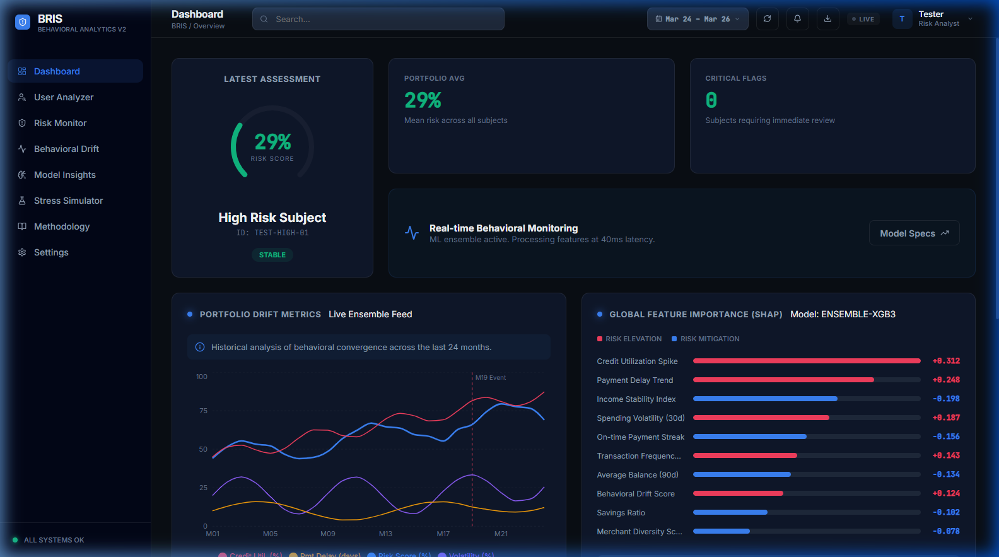
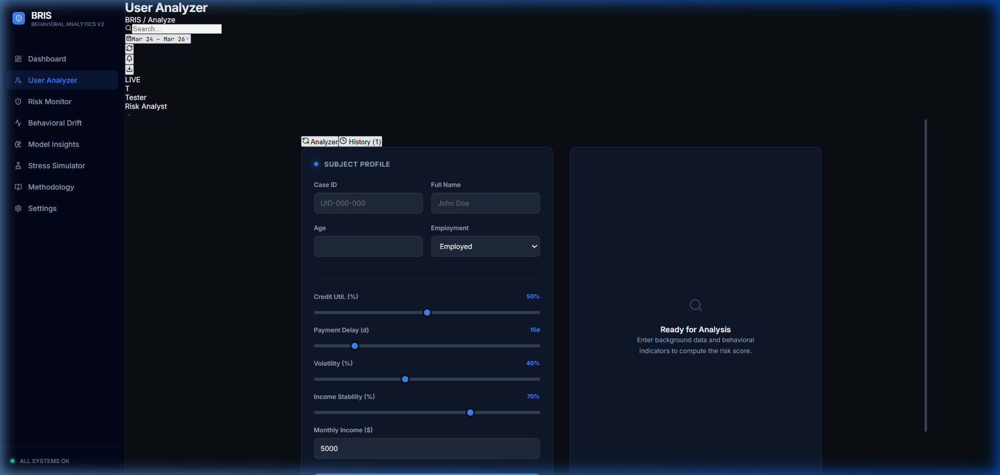

# BRIS: Behavioral Risk Intelligence System

## Overview
BRIS (Behavioral Risk Intelligence System) is a portfolio-level analytical framework designed to identify and quantify financial risk through the lens of behavioral drift. Unlike traditional scoring methods that rely on point-in-time financial snapshots, BRIS monitors continuous transaction sequences to detect early-warning signals of financial distress. The system is built to provide an interpretable, research-grade interface for risk analysts and data scientists.



## Core Methodology
The system employs a multi-model ensemble approach to provide robust risk estimations across varying behavioral contexts.

### Ensemble Architecture
The core prediction engine utilizes a weighted ensemble of:
- **XGBoost & LightGBM**: Gradient Boosted Decision Trees (GBDT) optimized for tabular behavioral snapshots and rate-of-change features.
- **LSTM Networks**: Recurrent layers designed to process sequential transaction data to capture temporal dependencies that static models overlook.

### Probability Calibration
Raw model outputs are calibrated via Platt scaling (Logistic Regression on validation sets) to ensure that predicted probabilities accurately reflect empirical default rates, minimizing the Brier score for reliability.

### Uncertainty Quantification
To account for model epistemic uncertainty, the system incorporates Monte Carlo (MC) Dropout sampling (n=500 passes). This provides a confidence interval around each point prediction, which is critical for high-stakes financial decision-making.

## Key Features

### Behavioral Drift Detection
The system monitors shifts in transaction patterns—such as credit utilization velocity, payment delay trends, and spending volatility—relative to a 90-day moving baseline.



### Explainable AI (XAI)
Per-prediction feature attribution is provided via SHAP (SHapley Additive exPlanations). This allows analysts to decompose a risk score into its constituent behavioral drivers, satisfying regulatory requirements for model transparency and auditability.

### Local Privacy
BRIS is designed as a browser-native or local-first application. All sensitive subject data and analysis history are stored within the client's local storage, ensuring that data never leaves the analyst's environment.

## Technical Stack
- **Frontend**: React 18, Vite, Lucide React, Recharts.
- **Styling**: Vanilla CSS3 with a custom SaaS-grade design system.
- **Backend (Optional)**: Python/FastAPI for large-scale training and high-fidelity inference.
- **Data Visualization**: Custom SVG-based gauge indicators and responsive charting containers.

## Getting Started

### Prerequisites
- Node.js (v18 or higher)
- npm or yarn

### Installation
1. Clone the repository:
   ```bash
   git clone https://github.com/ShraddhaBora/BRIS.git
   ```
2. Navigate to the project directory:
   ```bash
   cd BRIS
   ```
3. Install dependencies:
   ```bash
   npm install
   ```
4. Start the development server:
   ```bash
   npm run dev
   ```

## Academic Context
This framework draws upon principles from:
- Thomas et al. (2002) on credit scoring applications.
- Lundberg & Lee (2017) regarding unified approaches to model interpretability.
- Gal & Ghahramani (2016) on Bayesian approximations in deep learning.

## License
MIT License
